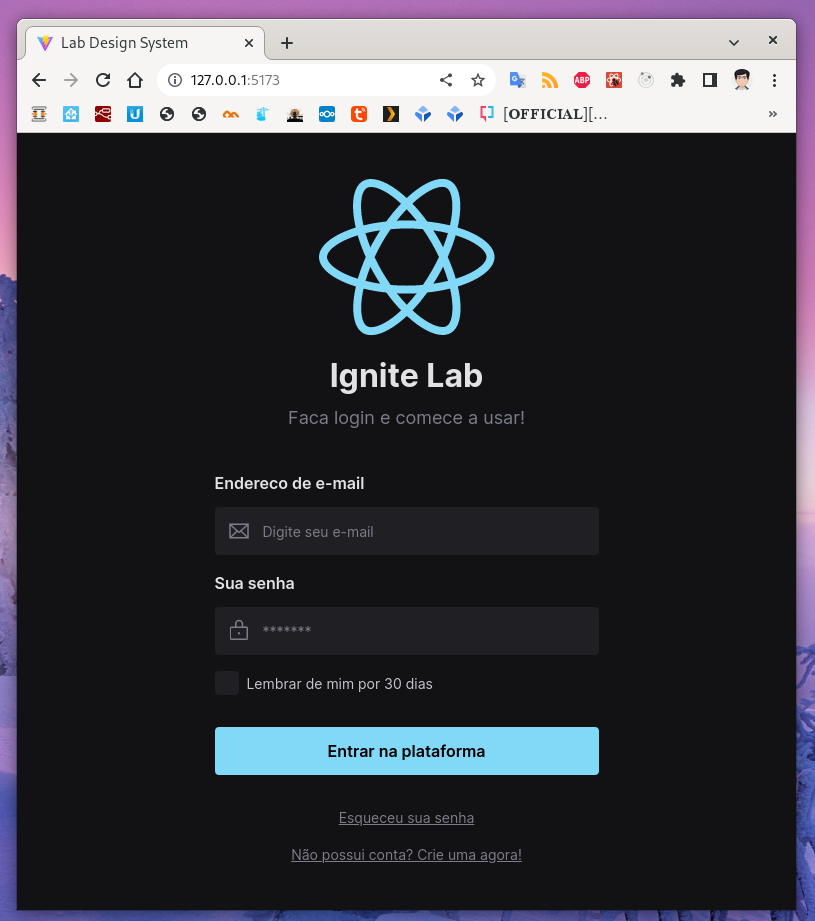

# Ignite Lab - Design System

Projeto desenvolvido no evento Ignite Lab da Rocketseat

## Aula 01 | Estrutura visual do Design System

Criação da estrutura visual do *Design System* no *Figma*.

Padronização da paleta de cores que será utilizada em todo o projeto.

Definição de componentes que irão fazer parte da biblioteca em *REACT*.

Agrupamento de elementos dentro do *Figma* capaz de se comportar de forma semelhante ao *display flex* do *CSS*

## Aula 02 | Do Figma ao React, criando aplicação

Exportação dos *tokens* e componentes do *Figma* para o código criado no projeto *REACT*.

Documetação sendo criada utilizando *Storybook*

## Aula 03 | Testando e automatizando

Envio do código para o *Github* e automatização do processo de publicação da documentação do *Storybook* no *Github pages* através das *Actions* do *Github*

Utilização dos componentes criados na aula anterior para o desenvolvimento da pagina de *login* de acordo com as especificações definidas previamente no *Figma*

## Principais Tecnologias/Ferramentas/Pacotes

- Figma
- REACT
- Storybook
- Storybook - acessibilidade
- vitejs
- JavaScript
- Typescript
- HTML
- CSS
- Radix-ui
- Tailwindcss
- Git
- Github Actions

## Contato

elciosato@gmail.com